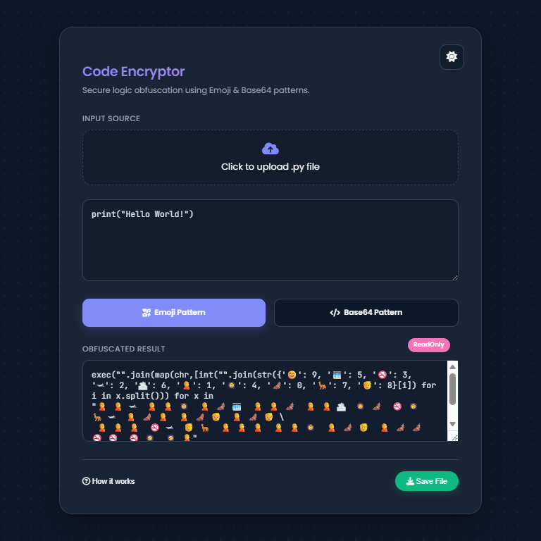
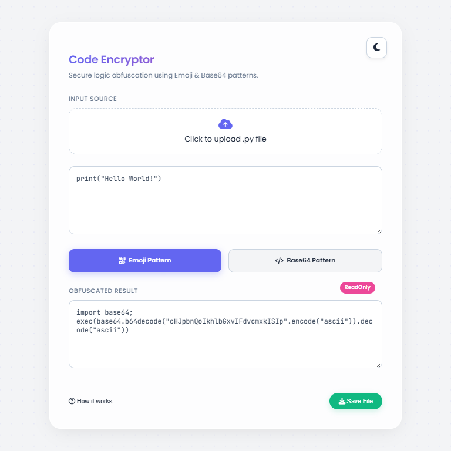
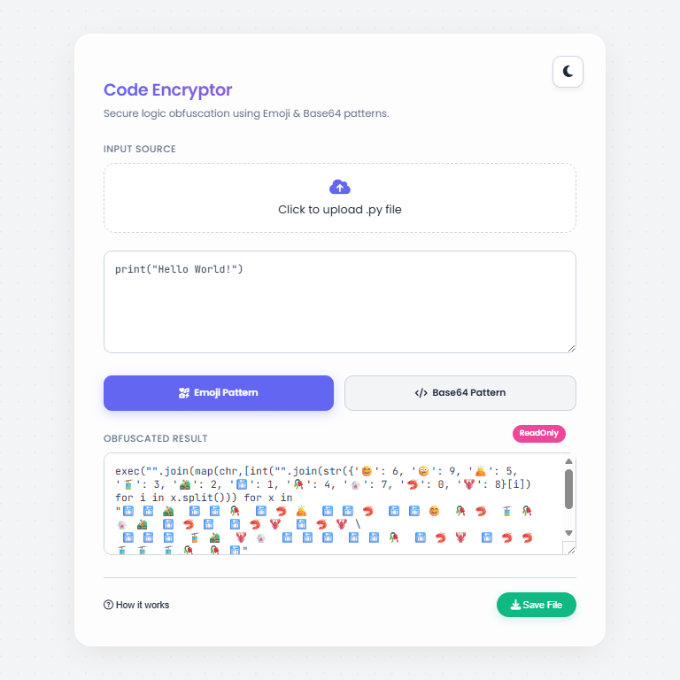
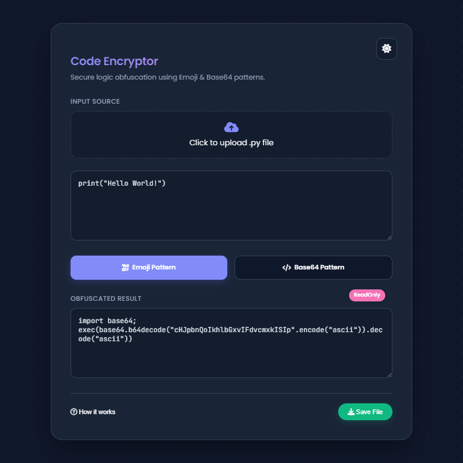

# 🔐 Code-Encrypter

**Secure logic obfuscation with a touch of fun.** Code-Encrypter transforms your readable Python logic into functional but unreadable patterns using **Emojis** or **Base64** encoding.

[](https://nishant-pratap-savita-code-encryptor.hf.space/)
[](https://choosealicense.com/licenses/mit/)
[](https://www.python.org/)

---

## ✨ New Glassmorphism UI
We've overhauled the interface with a modern **Glassmorphism design**, featuring a dynamic "Aurora" background and a seamless **Dark/Light mode switcher**.

### 🎨 Visual Gallery

| **Emoji Pattern (Dark Mode)** | **Base64 Pattern (Light Mode)** |
|:---:|:---:|
|  |  |

| **Emoji Pattern (Light Mode)** | **Base64 Pattern (Dark Mode)** |
|:---:|:---:|
|  |  |

---

## 🚀 Features
* **Dual Encryption Patterns:** Choose between the fun **Emoji Pattern** 🐍 or the standard **Base64 Pattern** ⚙️.
* **Theme Support:** Toggle between "Cyber Dark" and "Engineering Light" modes.
* **Offline Capability:** The desktop executable runs entirely offline for maximum security.
* **Cross-Platform:** Available as a Desktop GUI (Tkinter) and a Web App (Flask).
* **Zero Infrastructure:** Requires no database or external API calls.

---

## 🛠️ Installation

### Option A: Web Version (Recommended)
To run the modern web interface locally:

1.  **Clone the repository:**
    ```bash
    git clone https://github.com/Nishant2009/Code-Encrypter.git
    ```
    ```bash
    cd "Code-Encrypter/Encrypter Website"
    ```

2.  **Install dependencies:**
    ```bash
    pip install flask
    ```

3.  **Run the Flask App:**
    ```bash
    python app.py
    ```
    *Open `http://127.0.0.1:5000` in your browser.*

### Option B: Desktop Version (Legacy)
For the classic desktop experience:

1.  **Navigate to root:**
    ```bash
    cd Code-Encrypter
    ```

2.  **Run the Python Script:**
    ```bash
    python main.py
    ```

3.  **Or Run the Executable (Windows):**
    ```bash
    dist\Code Encryptor.exe
    ```

---

## 📖 Usage Guide

1.  **Select Source:** Click the upload area to drop a `.py` file, or paste your code directly into the editor.
2.  **Choose Pattern:**
    * Click **✨ Emoji Pattern** for a unique, symbol-based obfuscation.
    * Click **🔒 Base64 Pattern** for standard string encoding.
3.  **View & Save:** The obfuscated code appears instantly in the result box. Click **Save File** to download the ready-to-run script.

---

## 📄 License
This project is licensed under the [MIT License](https://choosealicense.com/licenses/mit/).

## 🤝 Support
Found a bug? Have a feature request? Please [open an issue](https://github.com/Nishant2009/Code-Encrypter/issues) on GitHub.
